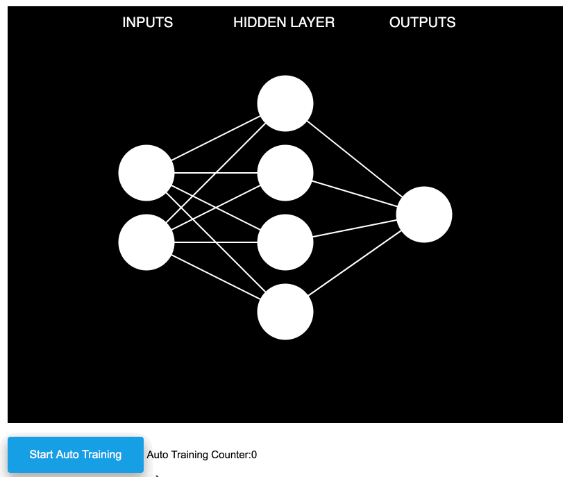
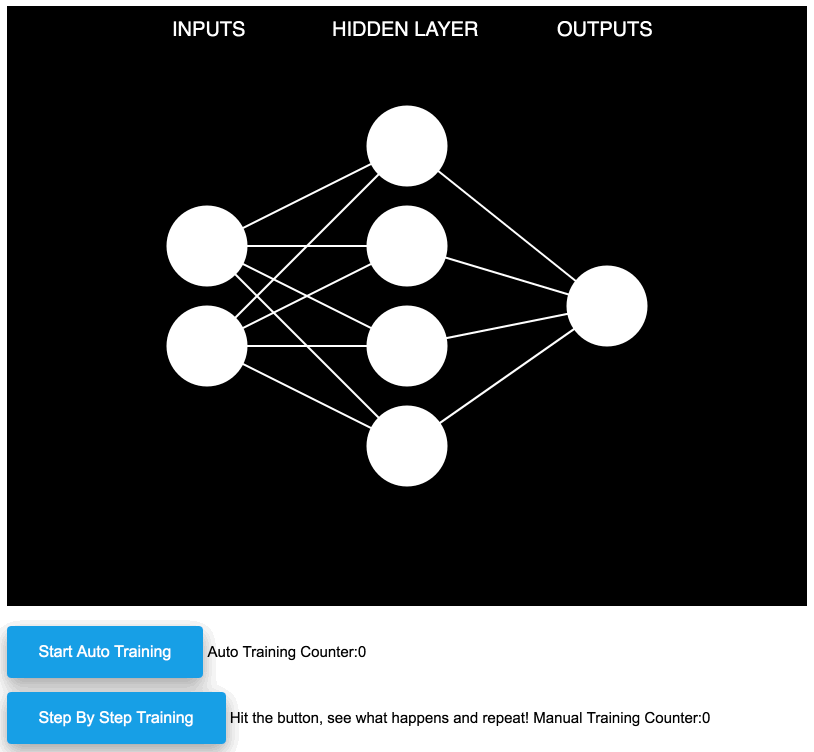

# neural-network-xor-visualization

I coded this visualization of top of [Daniel Shiffman](https://github.com/shiffman)'s neural network toy library.
Play with it [>>HERE<<](https://pascalguyon.org/lets-train-a-neural-network). 

